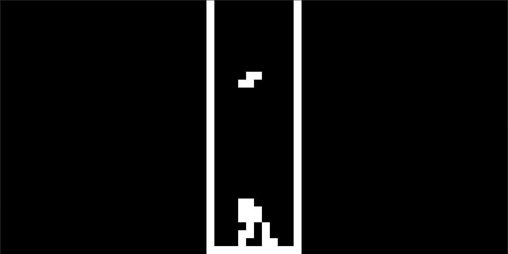
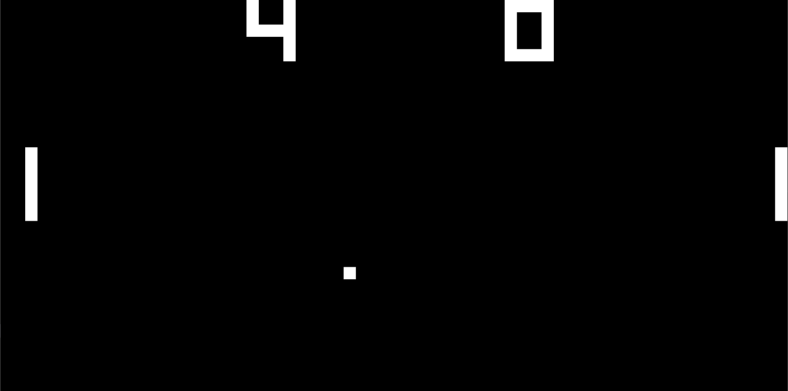

<h1 align="center">
   
  
   
  <b>Nova</b>
   
</h1>

Nova is a modular CHIP-8 emulator written in Rust with an egui/eframe interface, multilingual support, debugging tools, and configurable input/video/audio settings.
It is compatible with Windows, macOS, and Linux.

<h1 align="center">
  
  &nbsp;&nbsp;&nbsp;
  
  &nbsp;&nbsp;&nbsp;
  
    
  
</h1>

|                    Tetris                    |                    Pong                    |
| :------------------------------------------: | :----------------------------------------: |
|  |  |

|                Space Invaders                 |
| :------------------------------------------: |
|  |
