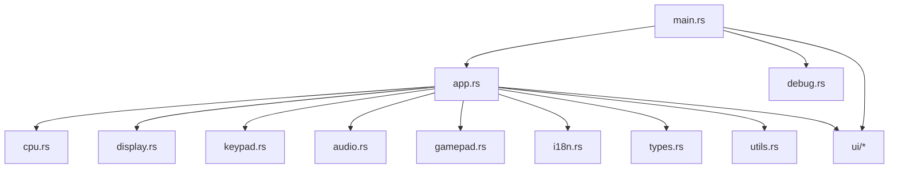
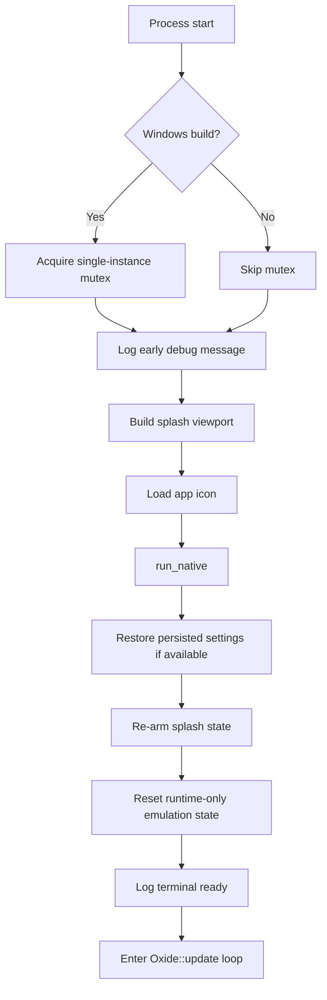
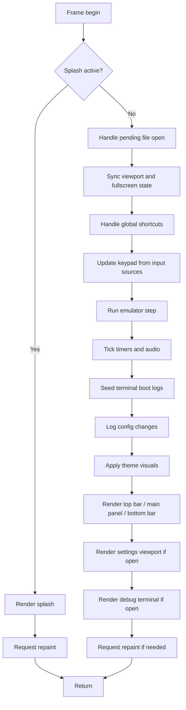

# Oxide - Architecture

This document describes the current crate layout, the main runtime data structures, and the high-level execution flow of Oxide.

## High-level layout

Main modules:

- `src/main.rs`: process entry point, window/bootstrap setup, splash initialization, Windows single-instance guard
- `src/app.rs`: `Oxide` application state, `eframe::App` implementation, runtime orchestration
- `src/cpu.rs`: CHIP-8 fetch/decode/execute loop and quirk-aware opcode behavior
- `src/display.rs`: 64x32 framebuffer state and pixel operations
- `src/keypad.rs`: CHIP-8 keypad state abstraction
- `src/audio.rs`: buzzer backend driven by `rodio`
- `src/gamepad.rs`: gamepad polling integration through `gilrs`
- `src/i18n.rs`: UI translations and shared translation loading
- `src/debug.rs`: low-level debug logging
- `src/debug/i18n.rs`: debug-string localization layer
- `src/types.rs`: enums and persistent configuration models
- `src/utils.rs`: mapping helpers, shortcuts, input translation helpers
- `src/constants.rs`: version string and UI/display constants
- `src/ui/`: top bar, bottom bar, main panel, settings window, debug terminal

## Core runtime objects

### `Oxide`

`Oxide` is the root application state.

It contains:

- emulation state: `cpu`, `display`, `keypad`, `rom_data`, `rom_path`
- presentation state: `theme`, `langue`, `video_scale`, `fullscreen`, `vsync`
- settings temp/snapshot state for deferred apply/cancel flows
- runtime flags for detached windows, focus handling, overlays, splash, cursor visibility
- debug terminal buffers and file handles
- save-state metadata and snapshots
- audio backend instance

`Oxide` also owns the frame loop through `impl eframe::App`.

### `CPU`

The CPU struct contains the CHIP-8 machine state:

- `v[16]`
- `i`
- `pc`
- `sp`
- `stack[16]`
- `delay_timer`
- `sound_timer`
- `memory[4096]`

Execution is quirk-aware via `CpuQuirks`.

### `Display`

`Display` stores the logical framebuffer used by the main panel.

- logical size: `64 x 32`
- pixel storage: flat vector of on/off values
- helpers: clear, read, and write pixels

### `AudioEngine`

`AudioEngine` is a minimal lazy backend:

- opens a default output stream only when needed
- plays a continuous `880 Hz` sine wave while the CHIP-8 sound timer is active
- maps UI volume `0..100` to a reduced output gain

## Startup flow

`main.rs` currently does the following:

1. On Windows, acquire a named mutex to prevent multiple instances.
2. Log early startup debug messages.
3. Build a compact splash viewport using the bundled logo size.
4. Load the main window icon from bundled `.ico` assets.
5. Start `eframe::run_native` with the splash viewport.
6. Re-arm splash state even when persistent settings were restored.
7. Reset ROM/runtime state while preserving persisted settings.
8. Hand control to `Oxide::update()`.

## Frame loop

Every frame, `Oxide::update()` drives the app in this rough order:

1. Render splash screen and early-return while splash is active.
2. Handle pending file open requests (`.state`, `.ch8`, `.rom`, `.bin`).
3. Synchronize window metrics, fullscreen state, and focus state.
4. Resize the main viewport when needed according to `video_scale`.
5. Process global shortcuts.
6. Update keypad state from keyboard, mouse, gamepad, and debug terminal input.
7. Advance emulation based on `stable_dt`.
8. Tick timers and drive the audio engine.
9. Seed debug terminal boot logs once.
10. Log runtime configuration changes.
11. Apply theme visuals.
12. Render top bar, bottom bar, display panel, settings window, and debug terminal.
13. Repaint continuously while emulation is active or overlays are visible.

## Detached windows

Oxide uses multiple viewports:

- main window: root application viewport
- settings window: detached configuration viewport
- debug terminal: detached logging/diagnostics viewport

Both detached windows are coordinated from `app.rs` and rendered in `src/ui/settings.rs` and `src/ui/debug_terminal.rs`.

## Settings architecture

The settings system uses a deferred-apply model.

Persistent live values:

- `theme`
- `langue`
- `vsync`
- `video_scale`
- `touches`
- `raccourcis`
- `cycles_par_seconde`
- `son_active`
- `sound_volume`
- `quirks`
- `quirks_preset`
- `terminal_active`

Temporary editing values:

- `temp_*`

Rollback snapshot values:

- `snapshot_*`

This allows:

- `Apply`: commit temp values without closing
- `OK`: commit and close
- `Cancel`: restore snapshots
- `Defaults`: reset current tab temp values
- `Reset all`: restore all defaults

## Save-state architecture

Save states are stored separately from UI persistence.

Persistent user settings use `eframe::Storage`, while save states are written as `.state` files on disk.

Important save-state types:

- `EmuSnapshot`
- `SaveStateMeta`
- `PersistedSaveState`

Save states are organized per ROM using a sanitized ROM name plus a stable FNV-1a hash.

## Localization architecture

UI translations are loaded from:

- `src/i18n/common.json`
- `src/i18n/<lang>.json`

Debug translations are loaded from:

- `src/debug/i18n/common.json`
- `src/debug/i18n/<lang>.json`

The `common.json` layer stores identical strings shared by all languages to reduce duplication.

## Logging architecture

There are two log layers:

- console/debug lifecycle logs via `src/debug.rs`
- in-app debug terminal logs managed by `Oxide`

Rotating on-disk log folders:

- `logs/app`
- `logs/emulator`

Previous `latest.logs` files are zipped on startup before the new session begins.

## Current design priorities

The codebase is currently structured around these goals:

- keeping emulation logic separated from UI rendering
- supporting configurable UX without losing deterministic CPU behavior
- preserving user settings while clearing runtime-only state at startup
- providing practical diagnostics for emulator development and ROM testing
