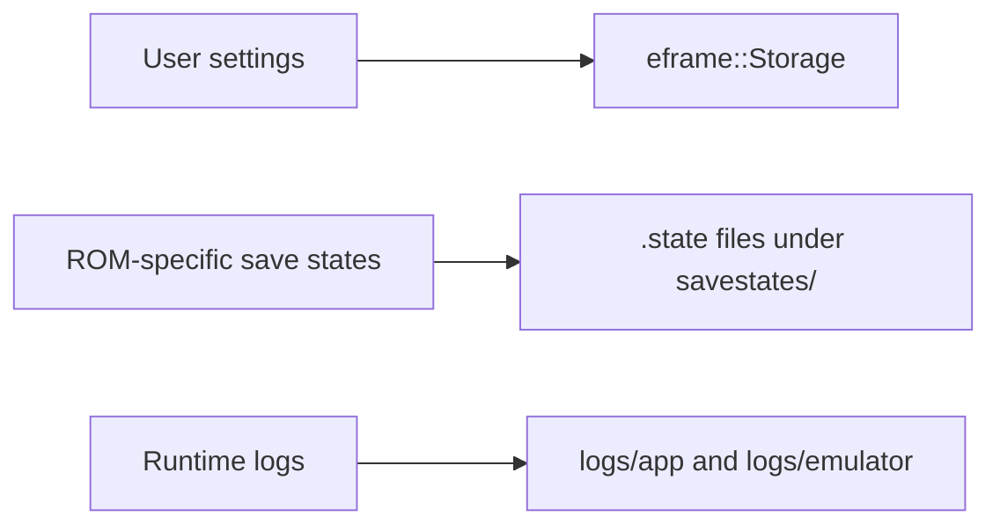
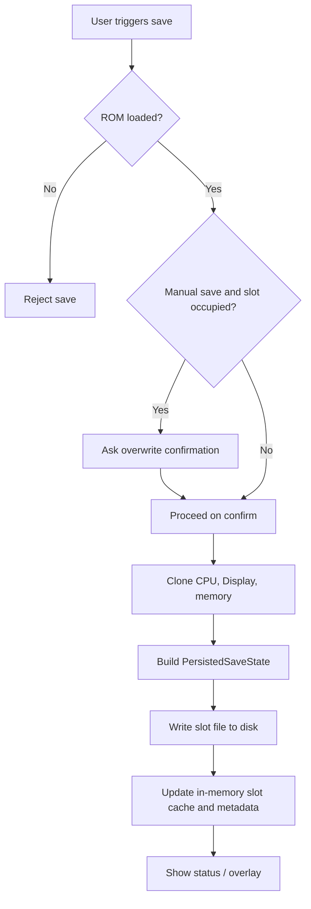
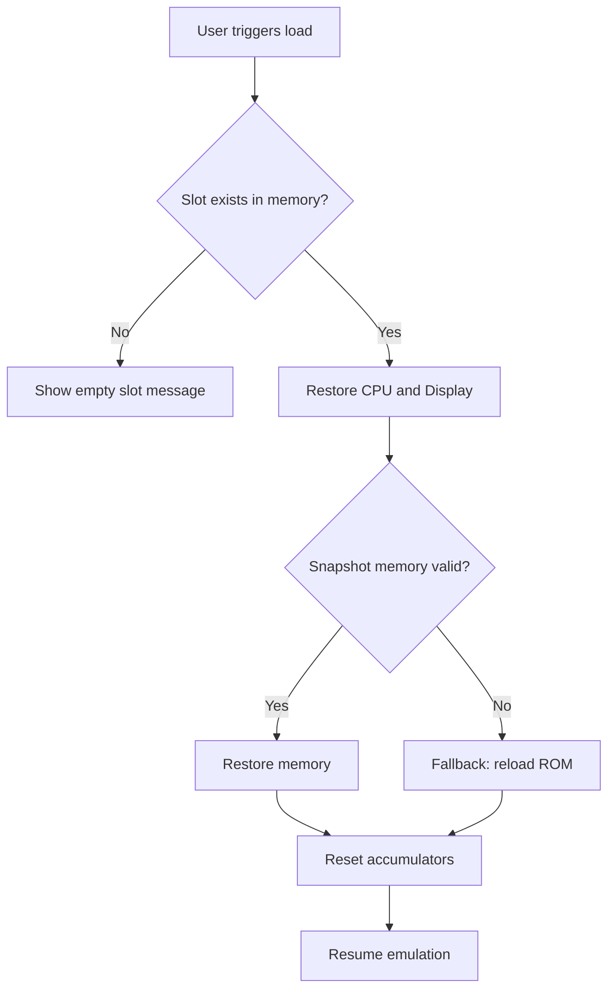

# Oxide - Save States and Persistence

This document describes how Oxide persists user configuration, save states, and runtime logs.

## Two persistence layers



Oxide currently uses two distinct persistence mechanisms:

1. UI/application settings via `eframe::Storage`
2. ROM-specific save states via `.state` files under `savestates/`

These two layers are intentionally separate.

## Persisted application settings

`Oxide::save()` stores user-facing configuration while stripping runtime-only state.

Persisted examples:

- theme
- language
- VSync
- video scale
- controls
- shortcuts
- CPU speed
- sound enabled / volume
- quirks and quirk preset
- debug terminal enabled state
- last ROM path

Runtime-only fields are explicitly reset before serialization, including:

- live CPU state
- live display state
- keypad state
- ROM bytes/path currently in memory
- terminal logs
- focus flags
- splash runtime data
- transient overlay state
- save-state cache arrays

This is why the app can restore preferences without booting into a stale emulation session.

## Save-state data model

Current save-state structures:

- `EmuSnapshot`
- `SaveStateMeta`
- `PersistedSaveState`

`PersistedSaveState` contains:

- save-state format version
- ROM name
- ROM hash
- ROM bytes
- ROM path
- slot index
- human-readable metadata
- emulation snapshot payload

## Slot model

Oxide exposes 3 save slots per ROM.

Slots are available from:

- top bar menus
- keyboard shortcuts
- debug terminal shortcuts
- explicit `.state` file loading

Manual save on an occupied slot can trigger an overwrite confirmation dialog.

## ROM identity and save directory layout

Save-state folders are generated from:

- sanitized ROM name
- stable FNV-1a 64-bit hash of ROM bytes

Typical layout:

```text
savestates/
└── <rom-name>-<rom-hash>/
    ├── <rom-name>_01_<timestamp>.state
    ├── <rom-name>_02_<timestamp>.state
    └── <rom-name>_03_<timestamp>.state
```

Only one current file per slot is retained; older slot files are replaced.

## Save flow



When saving a slot:

1. The app verifies that a ROM is loaded.
2. CPU, display, and memory state are cloned into `EmuSnapshot`.
3. Slot metadata is created with timestamp and ROM-derived display name.
4. A `PersistedSaveState` value is serialized to disk.
5. In-memory slot cache and UI metadata are updated.
6. A status/overlay message is shown.

Shortcuts bypass the overwrite dialog; manual saves can require confirmation.

## Load flow



When loading a slot:

1. The app checks whether a snapshot exists in memory.
2. CPU and display state are restored.
3. Memory is restored when the snapshot payload is valid.
4. If memory payload is not usable, the ROM can be reloaded as fallback.
5. Runtime accumulators are reset.
6. Emulation resumes from the restored state.

Oxide can also load a `.state` file directly from disk.

## Automatic slot discovery

When a ROM is loaded, Oxide scans the corresponding save-state directory and attempts to load the latest file for each slot.

Validation uses:

- ROM hash
- slot index
- matching folder naming conventions

This repopulates in-memory slot metadata for menus and overlays.

## Save-state compatibility notes

Each `.state` carries a `version` field.

That gives the project room to evolve the format later. At the moment, compatibility is tied to the current internal representation of the CPU/display snapshot types.

## Runtime log persistence

Oxide also persists log sessions separately from save states.

Folders:

- `logs/app/`
- `logs/emulator/`

Current session log file:

- `latest.logs`

On startup:

- previous `latest.logs` is compressed into a timestamped `.zip`
- a fresh `latest.logs` file is opened

This keeps session logs compact and avoids growing a single unbounded file.

## Exporting debug logs

From the debug terminal, logs can also be exported manually to a user-selected `.txt` or `.log` file.

This export is independent from the rotating session logs above.

## What is not persisted as settings

Important distinction:

- save states persist emulation state per ROM
- settings persistence does not keep an active emulation session alive between launches

At startup, runtime state is cleared intentionally even if preferences are restored.
