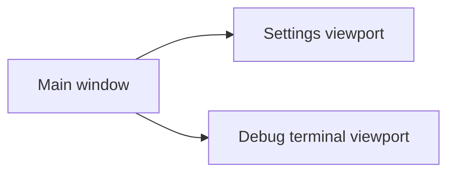
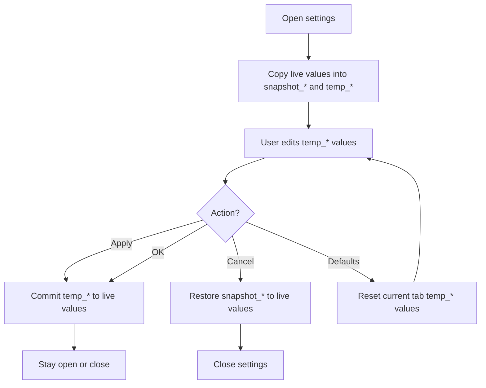
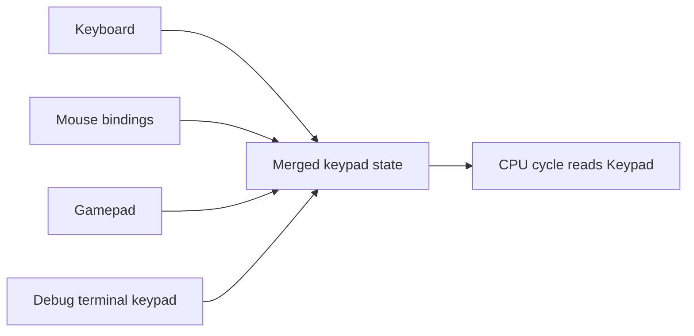

# Oxide - User Interface and Settings

This document describes the current user interface structure and the settings workflow.

## Main application windows

Oxide uses three main viewports:

- main window
- settings window
- debug terminal window

The main window is the root viewport.
The settings window and debug terminal are detached secondary viewports managed by the app state.

## Startup splash

At launch, Oxide first shows a splash screen:

- bundled logo
- transparent/decorless splash viewport
- animated logo pulse
- version text overlay

After the splash delay ends, the normal main UI takes over.

## Main window layout

The main window is split into:

- top bar
- central display panel
- bottom status bar

### Top bar

The top bar currently exposes:

- `Game`
- `Emulator`
- `Video`
- `Controls`
- `Shortcuts`
- `Debug`
- theme indicator / theme cycle button

Examples of actions available from menus:

- load game
- load recent ROM
- pause / resume
- reset
- stop
- save state / load state
- open settings tabs directly
- change language
- change render scale
- toggle VSync / fullscreen
- toggle debug terminal

### Central display panel

The main panel renders:

- the CHIP-8 framebuffer
- pause overlay
- temporary status overlays/messages

Display size depends on `video_scale` unless fullscreen/window constraints override it.

### Bottom status bar

The status bar summarizes runtime state such as:

- version
- ROM information
- running / paused state
- CPU speed
- FPS-related information
- volume / sound state

## Settings window

The settings window is a detached viewport with tabbed sections.

Current tabs:

- Emulator
- Video
- Audio
- Controls
- Shortcuts
- Debug

### Footer actions

The settings footer supports:

- `OK`: apply and close
- `Apply`: apply without closing
- `Defaults`: reset the current tab to default values
- `Cancel`: restore snapshots and close

If settings differ from the live app state, a pending-changes message is shown.

### Emulator tab

Contains items such as:

- theme selection
- language selection
- CPU speed
- full reset of all settings

### Video tab

Contains:

- VSync toggle
- render scale selection

### Audio tab

Contains:

- sound enabled toggle
- volume slider

### Controls tab

Contains the configurable CHIP-8 keypad mapping.

Supported sources:

- keyboard keys
- mouse buttons

Binding flow:

1. Click a key cell.
2. Oxide waits for the next supported input.
3. The binding is stored in temporary settings.
4. The user applies or cancels through the normal settings flow.

### Shortcuts tab

Contains configurable global shortcuts such as:

- load game
- pause
- reset
- stop
- fullscreen
- save state slots
- load state slots

### Debug tab

Contains:

- debug terminal toggle
- CPU quirk preset selection
- individual quirk toggles

## Temp/snapshot settings model

The settings window does not mutate everything immediately.

Instead, Oxide keeps:

- live values
- `temp_*` editable copies
- `snapshot_*` rollback copies

This enables correct `Apply`, `OK`, and `Cancel` behavior.

## Debug terminal

The debug terminal is a detached viewport rendered from `src/ui/debug_terminal.rs`.

Current features:

- live log display
- search/filter field
- export logs button
- test report button
- keyboard shortcut handling while focused
- optional virtual keypad contribution to emulation input

The terminal also follows the active application theme.

## Input sources merged into emulation

The CHIP-8 keypad state seen by the CPU is built from a merged view of:

- keyboard input
- mouse bindings
- gamepad state
- debug terminal keypad state

This merge happens before CPU execution for the frame.

## Themes

Current themes:

- `Kiwano`
- `Dark`
- `Light`

### Kiwano

Kiwano is the custom Oxide theme and the current default.

It provides:

- dark red / warm UI chrome
- custom widget visuals
- custom menu and popup styling
- branded top-bar theme icon

## Language system in the UI

The UI supports 12 languages:

- French
- English
- Spanish
- Italian
- German
- Portuguese
- Russian
- Chinese
- Japanese
- Korean
- Arabic
- Hindi

UI strings come from `src/i18n/common.json` plus language-specific JSON files.

Debug strings use the separate `src/debug/i18n/` layer.

## Window coordination details

The app keeps detached windows coordinated with the main viewport:

- settings can request focus when reopened
- debug terminal can request focus when toggled on
- main window tracks fullscreen/maximized state
- viewport sizes are updated according to current UI state

This coordination is handled centrally from `app.rs`.
